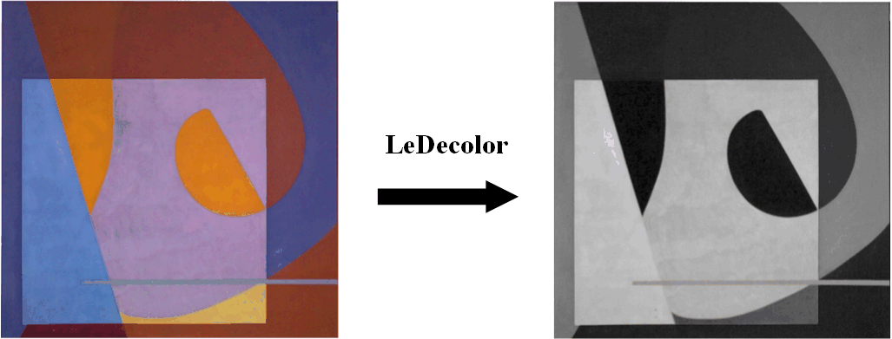

# LeDecolor
Log-Euclidean Metrics for Contrast Preserving Decolorization  
% [1] Q. Liu, G. Shao, Y. Wang, J. Gao, H. Leung, “Log-Euclidean Metrics for Contrast Preserving Decolorization”   
% IEEE Trans. Image Process., 26(12): 5772-5783, 2017.   
% Author: Q. Liu, G. Shao, Y. Wang, J. Gao, H. Leung  
% Date : 22/10/2016  
% Version : 1.0  
% The code and the algorithm are for non-comercial use only.  
% Copyright 2016, Department of Electronic Information Engineering, Nanchang University.  
% The current version is not optimized.  
% LeDecolor - Log-Euclidean Metrics for Contrast Preserving Decolorization  
% gIm = LeDecolor_v1(Im, gamma) performs contrast preserving decolorization  
% on color image Im, with controling parameter gamma  
%  
% Paras:  
% @Im : Input image (double), only color images are acceptable.  
% @gamma : Controlling parameter defined in [1]. 0.2 by default.  
%  
% Example  
% ==========  
% Im = im2double(imread('6.png'));  
% gIm = LeDecolor_v1(Im); % Default Parameters (gamma = 0.2)  
% figure, imshow(Im,[]), figure, imshow(gIm,[]); 

## Demonstration of LeDecolor
  

## Other Related Projects
  * GcsDecolor: Gradient Correlation Similarity for Efficient Contrast Preserving Decolorization [**[Paper]**](https://ieeexplore.ieee.org/abstract/document/7088620)   [**[Code]**](https://github.com/yqx7150/GcsDecolor)

  * Semiparametric Decolorization With Laplacian-Based Perceptual Quality Metric
[**[Paper]**](https://ieeexplore.ieee.org/document/7456206)   [**[Code]**](https://github.com/yqx7150/SPDecolor)

  * Variable augmented neural network for decolorization and multi-exposure fusion [**[Paper]**](https://www.sciencedirect.com/science/article/abs/pii/S1566253517305298)   [**[Code]**](https://github.com/yqx7150/DecolorNet_FusionNet_code)

  * Color-to-gray Conversion on Wallpaper Dataset
[**[Dataset]**](https://github.com/yqx7150/DecolorNet_FusionNet_code/tree/master/Wallpapers_Dataset) 
